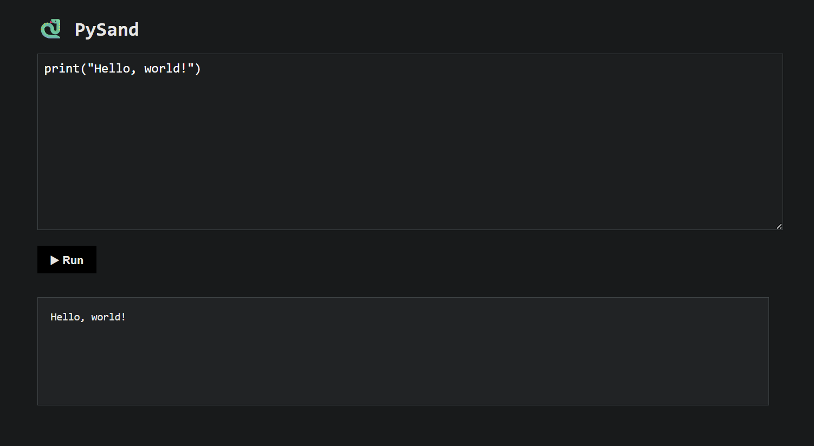

# PySand

Simple Python sandbox.
Made by FedotovDev.

## Contributions
Contributions are welcome! There is no contribution policy, so I accept (almost) every contribution.

## Special thanks to...
- Guido van Rossum for making the awesome Python programming language
- CWHengProj (https://github.com/CWHengProj) for fixing an output bug (pull request #3)

## License
I made this just for fun, so you can do whatever you want to this code (it has a mit license) :p

But it still would be great if you would credit me.
